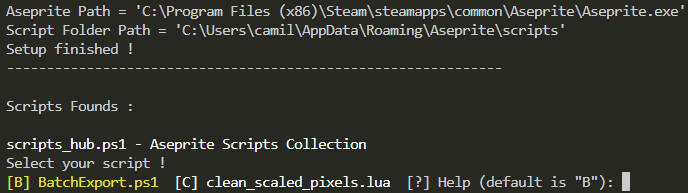

# AsecriptHub

A CLI Script Launcher for Aseprite Scripts.

- [AsecriptHub](#asecripthub)
  - [Installation](#installation)
  - [Usage](#usage)
  - [Integrated Scripts](#integrated-scripts)
  - [Adding AsecriptHub as an alias](#adding-asecripthub-as-an-alias)

## Installation

1. Download the [release](https://github.com/Camille-Gouneau/AsecriptHub/releases) and unzip it.
   1. (Optional) : Add `AsepriteHub.ps1` as an [alias](#adding-asecripthub-as-an-alias) in your PowerShell profile.
2. Change the params.
   1. On the first line, put your path to Aseprite.exe
   2. On the second line, put your script folder. I put my Aseprite script folder here so I can use my lua scripts from aseprite if I want to.
3. That's it !

## Usage

Every LUA and PowerShell script present in the script folder will be runnable from the Asecript Hub.  



## Integrated Scripts

There are a few scripts already available to use with AsepriteHub :

1. [BatchExport](./Scripts%20README/BatchExportREADME.md)
2. [BatchCommand](./Scripts%20README/BatchCommandREADME.md)

## Adding AsecriptHub as an alias

If you do not know how alias works in PowerShell, check [this](https://learn.microsoft.com/en-us/powershell/module/microsoft.powershell.core/about/about_aliases?view=powershell-7.3) and [this](https://stackoverflow.com/questions/24914589/how-to-create-permanent-powershell-aliases) out.

Once you do, add this code to your profile.ps1 :

```powershell
New-Alias -Name Asecript -Value <Path to your AsecriptHub.ps1>
```

Mine is located at [User\Documents\Repos\AsecriptHub\AsecriptHub.ps1] so I added this line :

```powershell
New-Alias -Name Asecript -Value ~\Documents\Repos\AsecriptHub\AsecriptHub.ps1
```
