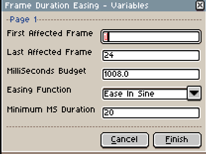
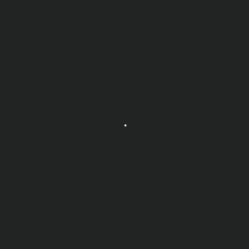

# Ease Frame Duration

A LUA script to change the duration of frames based on easing functions.

[Return to the Integrated Script List](../README.md#integrated-scripts)

- [Ease Frame Duration](#ease-frame-duration)
	- [Installation](#installation)
	- [Description](#description)
	- [Using the script](#using-the-script)
		- [Parameters](#parameters)
	- [Examples](#examples)

## Installation

Add this [script](../scripts/EaseFrameDuration.lua) to your Aseprite script folder.

## Description

This script allows you to change the framerate of individuals frames following the maths of [easings functions](https://easings.net/). That means that your animations frames wont have a constant framerate. This allow to create interesting effects.

## Using the script

When launching the script, it will put up a prompt asking you to enter some parameters.

### Parameters

Theses parameters will be automatically prompted in CLI in this order.

- `First Frame` : The first affected frame.
  - Default is 1.
- `Last Frame` : Allow the script to find and export files in subfolder of the `SpriteFolder`.
  - Default is `true`.
- `MilliSeconds Budget` : The amount of milliseconds to divide between each frames.
  - Default value is the sum of every frames duration.
- `Easing Function` : The easing function that will be used to math out the frames durations.
  - Default is `Ease In Sine`.
- `Minimum MS Duration` : The minimum duration of a frame.
  - Default is `20`. My experiment have shown me that going under 20 can sometimes lag horribly the gif output, due to how gif are limited to 100FPS by the Standard and 50FPS by almost all web players.
  - Every ms added isn't counted toward the budget, which might add a few % to your total duration.
  - Set this to 0 if you do not care about conversion to gif.

Clicking on `Finish` will compute the frames numbers and enter them directly to the appropriate frames.

## Examples

- Linear (no changes) :  

- Ease Out Sine with minimum of 0 (aka slowing down) :  

- Ease Out Circ with minimum of 20 (aka really slowing down a lot) (notice that due to the additional delay, the gif isn't synced) :  

- Ease In Out Quad (accelerate at first, slow down then accelerate again) :  
