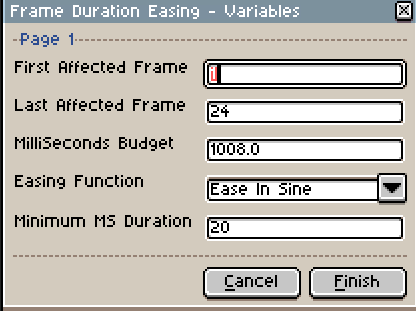

# BatchExport

A LUA script to export a batch of Aseprite file.

[Return to the Integrated Script List](../README.md#integrated-scripts)

- [BatchExport](#batchexport)
	- [Installation](#installation)
	- [Description](#description)
	- [Using the script](#using-the-script)
		- [Parameters](#parameters)

## Installation

Add this script to your Aseprite script folder.

## Description

This script allows you to change the framerate of individuals frames following the maths of [easings functions](https://easings.net/). That means that your animations frames wont have a constant framerate. This allow to create interesting effects.

## Using the script

When launching the script, it will put up a prompt asking you to enter some parameters.

### Parameters

Theses parameters will be automatically prompted in CLI in this order.

- `First Frame` : The first affected frame.
  - Default is 1.
- `Last Frame` : Allow the script to find and export files in subfolder of the `SpriteFolder`.
  - Default is `true`.
- `MilliSeconds Budget` : The amount of milliseconds to divide between each frames.
  - Default value is the sum of every frames duration.
- `Easing Function` : The easing function that will be used to math out the frames durations.
  - Default is `Ease In Sine`.

Clicking on `Finish` will compute the frames numbers and enter them directly to the appropriate frames.
