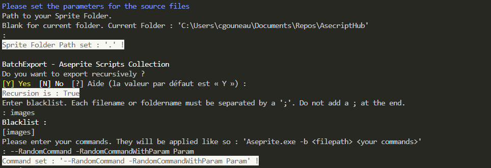
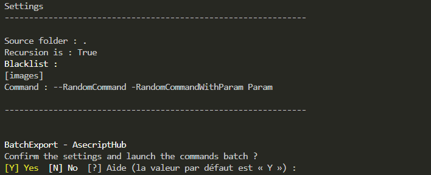

# BatchCommand

A PowerShell script to use Aseprite CLI on a batch of Aseprite files.

[Return to the Integrated Script List](../README.md#integrated-scripts)

- [BatchCommand](#batchcommand)
  - [Installation](#installation)
  - [Description](#description)
  - [Using the script](#using-the-script)
    - [Parameters](#parameters)
    - [Input Validation](#input-validation)
    - [Execution](#execution)

## Installation

The script have been developed to work in tandem with the [asecript_hub](../README.md) script.  
You can still use it alone by passing the -AsepritePath parameter to it.

## Description

This script allows you to apply some CLI to an entire folder and every sub-folder of .ase and .aseprite files while choosing Recursivity and adding a Blacklist.  
The only mandatory parameter is AsepritePath.  
The others parameters will be prompted in CLI.  

## Using the script

### Parameters

Theses parameters will be automatically prompted in CLI in this order.

- `SpriteFolder` : Where your .ase & .aseprite files are located.
  - Default is the current folder `.\`.
- `Recursion` : Allow the script to find and applyl the commands to files in subfolder of the `SpriteFolder`.
  - Default is `true`.
- `Blacklist` : Allow you to blacklist certain files and folders.
  - Default is no blacklist.
  - Enter the full name of files (`apple.aseprite`) and separate each entry by `;`.
  - Example : `apple.aseprite;hero;swordSwing.ase`. This will blacklist the `apple.aseprite` and `swordSwing.ase` files, and the entire `hero` folder.
- `Command` : The applied command line to each files. The command line will be applied as such : `Aseprite.exe <file path> <commands>`

### Input Validation

Did you made a mistake ? After filling in all the parameters, you must answer yes to a prompt to validate and start the generation.

### Execution

Now, sit back and relax. All of your files are being processed...

You can see which files are being processed and follow along if you want.

