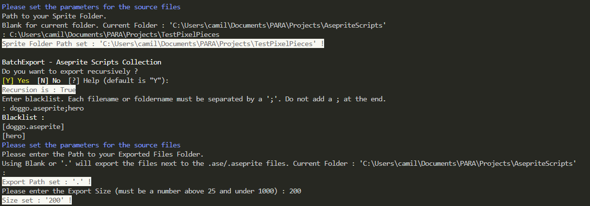
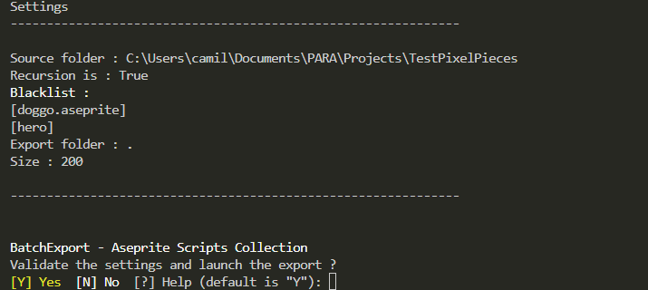
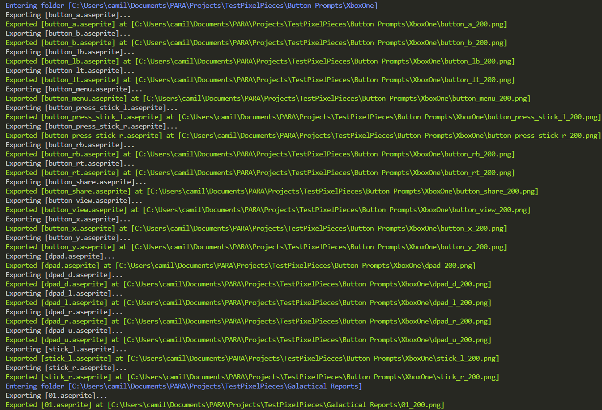
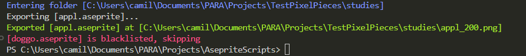

# BatchExport

An aseprite file batch exporting to .png  

[Return to the Integrated Script List](../README.md#integrated-scripts)

- [BatchExport](#batchexport)
  - [Installation](#installation)
  - [Description](#description)
  - [Using the script](#using-the-script)
    - [Parameters](#parameters)
    - [Input Validation](#input-validation)
    - [Exporting](#exporting)

## Installation

The script have been developed to work in tandem with the [asecript_hub](../README.md) script.  
You can still use it alone by passing the -AsepritePath parameter to it.

## Description

This script allows you to export an entire folder and every sub-folder of .ase and .aseprite files with a lot of options.  
The only mandatory parameter is AsepritePath.  
The others parameters will be prompted in CLI.  

## Using the script

### Parameters

Theses parameters will be automatically prompted in CLI in this order.

- `SpriteFolder` : Where your .ase & .aseprite files are located.
  - Default is the current folder `.\`.
- `Recursion` : Allow the script to find and export files in subfolder of the `SpriteFolder`.
  - Default is `true`.
- `Blacklist` : Allow you to blacklist certain files and folders.
  - Default is no blacklist.
  - Enter the full name of files (`apple.aseprite`) and separate each entry by `;`.
  - Example : `apple.aseprite;hero;swordSwing.ase`. This will blacklist the `apple.aseprite` and `swordSwing.ase` files, and the entire `hero` folder.
- `ExportPath` : Where the exported files should be stored.
  - Default is `.\`. This isn't the current directory, but the directory where the sprites files are found.
- `Size` : the export size, in percent.
  - `Size` must be between `25` & `1000`

### Input Validation

Did you made a mistake ? After filling in all the parameters, you must answer yes to a prompt to validate and start the generation.

### Exporting

Now, sit back and relax. All of your files will be named `<filenameWithoutExtension>_<Size>.png`

That's it, your files are exported !